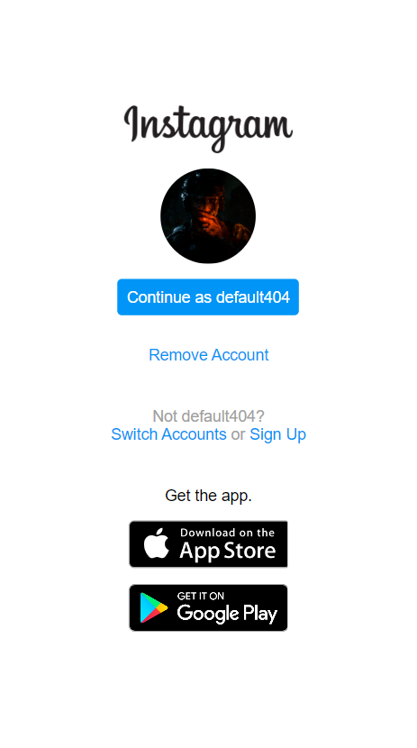

# 🎓 2º Desafio DIO 🎓
## "Recriando a página inicial do Instagram"

Projeto pratico que tem como objetivo a recriação da pagina inicial do Instagram utilizando os conhecimentos de HTML, CSS com Flexbox e responsividade aprendidos até o momento no Bootcamp Geração Tech Unimed-BH | Fullstack.

